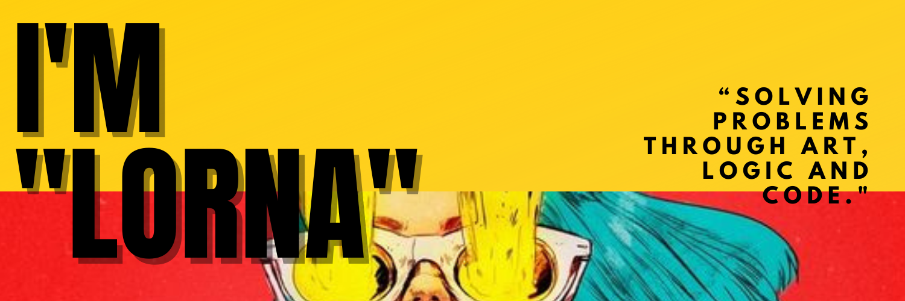

<!--
**Haldgerd/Haldgerd** is a ✨ _special_ ✨ repository because its `README.md` (this file) appears on your GitHub profile.

Here are some ideas to get you started:

- 🔭 I’m currently working on ...
- 🌱 I’m currently learning ...
- 👯 I’m looking to collaborate on ...
- 🤔 I’m looking for help with ...
- 💬 Ask me about ...
- 📫 How to reach me: ...
- 😄 Pronouns: ...
- ⚡ Fun fact: ...
-->

 return

  Avid geek, cyberpunk fan and a self taught programmer. I'm passionate about tehnology and programming. I love solving problems using uncoventional ways, using creative processes combined with logicial thinking.

---

<h2 align="center" color="#F0CB29">LANGUAGES AND TOOLS OF CREATION</h2>

---

<h2 align="center" color="#F0CB29">CONTACT ME</h2>

---

  
  

