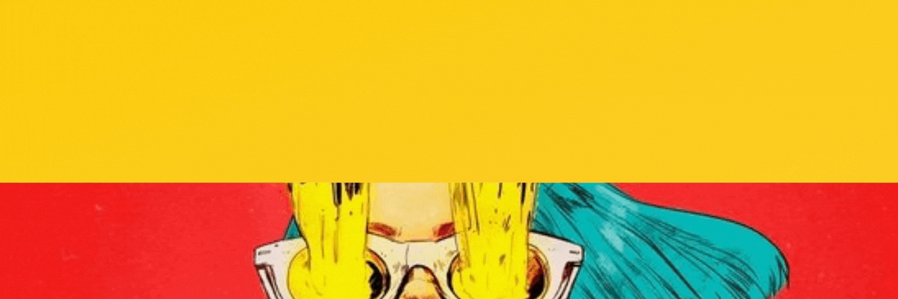

<!--
**Haldgerd/Haldgerd** is a ✨ _special_ ✨ repository because its `README.md` (this file) appears on your GitHub profile.-->

  

  I'm a huge geek, cyberpunk fan with unhealthy love for retrowave and synthwave music and a <strong>developer</strong>. I'm passionate about tehnology and programming. Solving problems using uncoventional ways, combining creative processes (illustration, animation)  with logicial thinking is my soul purpose. I just simply adore combining ART and CODE, being edgy, BOLD and creative with every project I do! I also emphasis a lot on clean (DRY), readable code.  

Specific fields of my interest inculde:

  <ul>
    <li>Game development ()</li>
    <li>Game development (Unity)</li>
    <li>Game development (Unreal)</li>
    <li>Focused on BOLD, dustrial, design solutions (the designers republic, anyone?).</li>
    <li>Web design (art, ART! Everywhere! I LOVE IT.)
    <li>Python (which I adore!)</li>
    <li>Linux system</li>
  </ul>

 

 

  I'm working with:
   
  
  
  
  
  
  
  
  
  
    

<!--

  <h1>PROJECTS AND DESIGNS banner</h1>
  
Bold designs and edgy colors.

-->

 

 

Open for collaboration on edgy and interesting projects.

For all things programming and geek related simply e-mail me at <a style="color: yellow;">haldgerd.code@gmail.com</a>.

